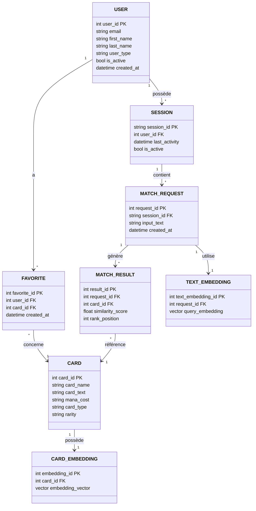

# Diagramme de Classes - MagicSearch

```mermaid
classDiagram
    class USER {
        int user_id PK
        string email
        string first_name
        string last_name
        string user_type
        bool is_active
        datetime created_at
    }

    class CARD {
        int card_id PK
        string card_name
        string card_text
        string mana_cost
        string card_type
        string rarity
    }

    class CARD_EMBEDDING {
        int embedding_id PK
        int card_id FK
        vector embedding_vector
    }

    class FAVORITE {
        int favorite_id PK
        int user_id FK
        int card_id FK
        datetime created_at
    }

    class SESSION {
        string session_id PK
        int user_id FK
        datetime last_activity
        bool is_active
    }

    class MATCH_REQUEST {
        int request_id PK
        string session_id FK
        string input_text
        datetime created_at
    }

    class MATCH_RESULT {
        int result_id PK
        int request_id FK
        int card_id FK
        float similarity_score
        int rank_position
    }

    class TEXT_EMBEDDING {
        int text_embedding_id PK
        int request_id FK
        vector query_embedding
    }

    USER "1" --> "*" FAVORITE : a
    USER "1" --> "*" SESSION : possède
    FAVORITE "*" --> "1" CARD : concerne
    SESSION "1" --> "*" MATCH_REQUEST : contient
    MATCH_REQUEST "1" --> "*" MATCH_RESULT : génère
    MATCH_RESULT "*" --> "1" CARD : référence
    CARD "1" --> "1" CARD_EMBEDDING : possède
    MATCH_REQUEST "1" --> "1" TEXT_EMBEDDING : utilise
```
