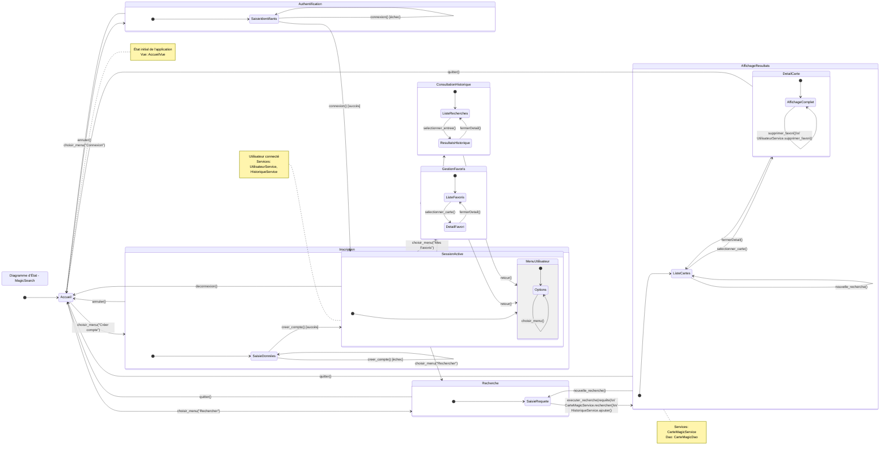

```mermaid
stateDiagram-v2
    direction LR
    title: Diagramme d'État - MagicSearch
    
    [*] --> Accueil
    Accueil --> Authentification : choisir_menu("Connexion")
    Accueil --> Recherche : choisir_menu("Rechercher")
    Accueil --> Inscription : choisir_menu("Créer compte")
    
    state Authentification {
        [*] --> SaisieIdentifiants
        SaisieIdentifiants --> SessionActive : connexion() [succès]
        SaisieIdentifiants --> SaisieIdentifiants : connexion() [échec]
    }
    
    Authentification --> Accueil : annuler()
    
    state Inscription {
        [*] --> SaisieDonnées
        SaisieDonnées --> SessionActive : creer_compte() [succès]
        SaisieDonnées --> SaisieDonnées : creer_compte() [échec]
    }
    
    Inscription --> Accueil : annuler()
    
    state SessionActive {
        [*] --> MenuUtilisateur
        state MenuUtilisateur {
            [*] --> Options
            Options --> Options : choisir_menu()
        }
    }
    
    SessionActive --> Recherche : choisir_menu("Rechercher")
    SessionActive --> GestionFavoris : choisir_menu("Mes Favoris")
    SessionActive --> ConsultationHistorique : choisir_menu("Historique")
    SessionActive --> Accueil : deconnexion()
    
    state GestionFavoris {
        [*] --> ListeFavoris
        ListeFavoris --> DetailFavori : selectionner_carte()
    }
    
    state ConsultationHistorique {
        [*] --> ListeRecherches
        ListeRecherches --> ResultatsHistorique : selectionner_entree()
    }
    
    GestionFavoris --> MenuUtilisateur : retour()
    ConsultationHistorique --> MenuUtilisateur : retour()
    DetailFavori --> ListeFavoris : fermerDetail()
    ResultatsHistorique --> ListeRecherches : fermerDetail()
    
    state Recherche {
        [*] --> SaisieRequete
    }
    
    SaisieRequete --> AffichageResultats : executer_recherche(requête)\n/ CarteMagicService.rechercher()\n/ HistoriqueService.ajouter()
    
    state AffichageResultats {
        [*] --> ListeCartes
        ListeCartes --> ListeCartes : nouvelle_recherche()
        ListeCartes --> DetailCarte : selectionner_carte()
    }
    
    AffichageResultats --> SaisieRequete : nouvelle_recherche()
    
    state DetailCarte {
        [*] --> AffichageComplet
        AffichageComplet --> AffichageComplet : ajouter_favori()\n/ UtilisateurService.ajouter_favori()
        AffichageComplet --> AffichageComplet : supprimer_favori()\n/ UtilisateurService.supprimer_favori()
    }
    
    DetailCarte --> ListeCartes : fermerDetail()
    
    %% Transitions de retour vers l'accueil
    Recherche --> Accueil : quitter()
    AffichageResultats --> Accueil : quitter()
    DetailCarte --> Accueil : quitter()

    note right of Accueil
        État initial de l'application
        Vue: AccueilVue
    end note

    note left of SessionActive
        Utilisateur connecté
        Services: UtilisateurService, HistoriqueService
    end note

    note right of AffichageResultats
        Services: CarteMagicService
        Dao: CarteMagicDao
    end note
```
