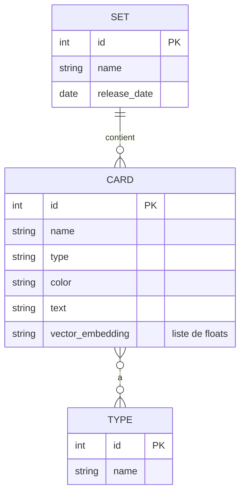

```mermaid
erDiagram
    CARD {
        int id PK
        string name
        string type
        string color
        string text
        string vector_embedding "liste de floats"
    }
    SET {
        int id PK
        string name
        date release_date
    }
    TYPE {
        int id PK
        string name
    }

    SET ||--o{ CARD : "contient"
    CARD }o--o{ TYPE : "a"
```
